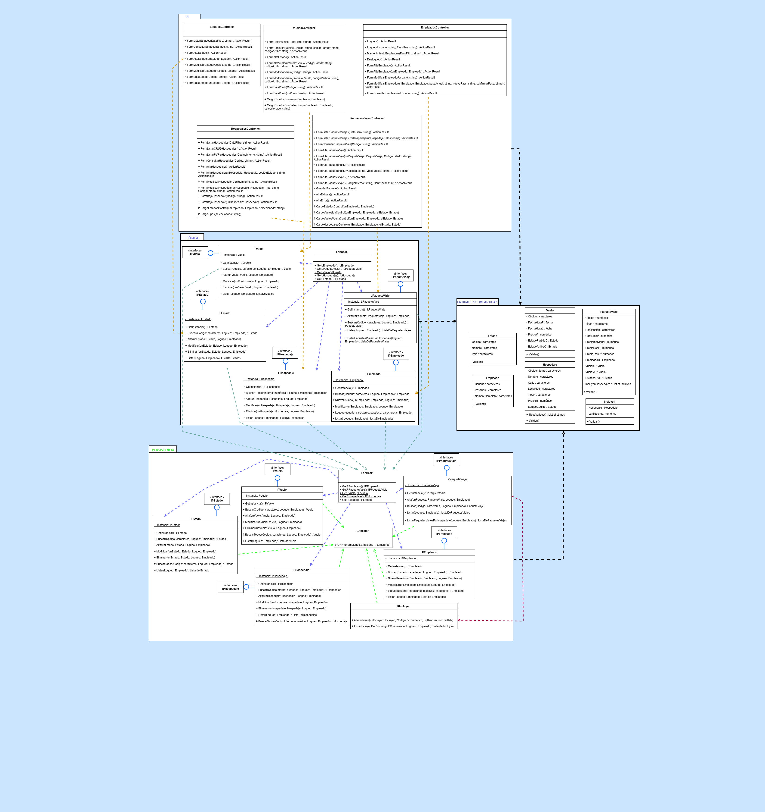
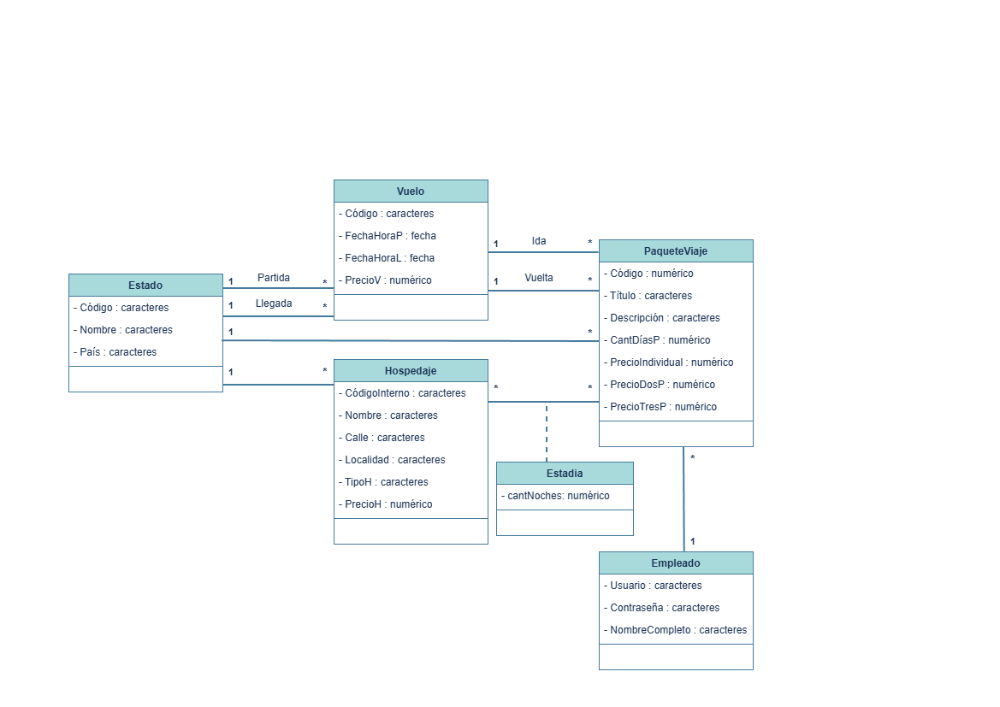
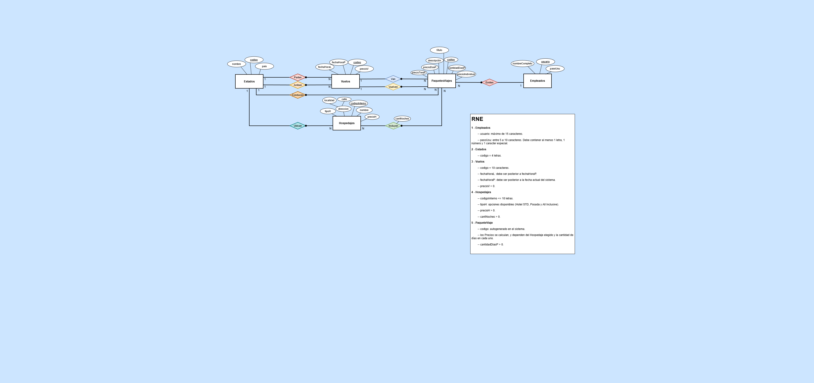
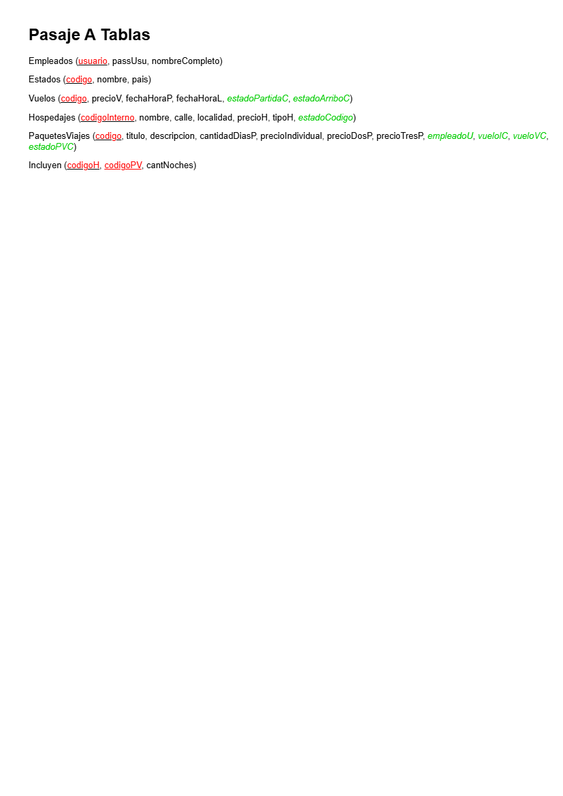

# BiosTravel-NET
Este proyecto corresponde al trabajo final de segundo año de la carrera Analista Programador .NET.
La aplicación consiste en un sistema web para la gestión y publicación de paquetes turísticos, desarrollado utilizando ASP.NET MVC sobre .NET Framework 4.5.2, siguiendo un enfoque de arquitectura en capas.
El sistema está dividido en dos secciones principales:
Sección privada (Back Office)
Utilizada por empleados de la agencia para administrar la información del sistema.
Sección pública
Disponible para cualquier visitante del sitio, donde se pueden visualizar los paquetes de viaje disponibles.
El objetivo del sistema es permitir a una agencia gestionar viajes, vuelos y paquetes turísticos, y a su vez publicarlos para que los usuarios puedan consultarlos fácilmente.

## Tecnología utilizada
Framework: .NET Framework 4.5.2 (versión requerida por la carrera)
Lenguaje: C#
Arquitectura: Arquitectura en capas
Base de datos: Microsoft SQL Server
Acceso a datos: Stored Procedures, ADO.NET
Tecnología web: ASP.NET MVC, Razor Views, HTML5, CSS3
Manipulación de datos: LINQ
Gestión de estado: Session State Management
Herramientas utilizadas: Visual Studio, SQL Server Management Studio

## Funcionalidades principales
Arquitectura del sistema
Implementación de una arquitectura en capas, separando:
Entidades
Persistencia
Lógica de negocio
Presentación
Esto permite una mejor organización del código, mantenibilidad y separación de responsabilidades.

## Back Office para empleados
Sección privada del sistema destinada a la administración interna de la agencia.
Permite a los empleados:
Crear y administrar paquetes de viaje
Asociar vuelos de ida y vuelta
Definir precios según cantidad de pasajeros
Gestionar la información descriptiva de cada paquete
Consultar vuelos disponibles
Controlar el estado de los vuelos
El acceso a esta sección se encuentra restringido mediante autenticación y manejo de sesiones.

## Catálogo público de paquetes de viaje
La sección pública del sitio permite que cualquier visitante pueda:
Visualizar los paquetes de viaje disponibles
Consultar destinos y fechas de salida
Ver el detalle de cada paquete
Conocer precios y características del viaje
Esta sección funciona como un catálogo público de viajes futuros ofrecidos por la agencia.

## Acceso a datos mediante Stored Procedures
La interacción con la base de datos se realiza mediante procedimientos almacenados en SQL Server, permitiendo:
Centralizar la lógica de acceso a datos
Mejorar el control de consultas
Optimizar la seguridad del sistema

## Manipulación de datos con LINQ
Uso de LINQ para:
Filtrar colecciones
Ordenar resultados
Transformar listas utilizadas en la capa de presentación

## Manejo de sesiones y seguridad
Implementación de Session State para:
Mantener autenticados a los empleados
Restringir el acceso a funcionalidades administrativas
Controlar el estado de la sesión de usuario

## Documentación técnica

A continuación se presentan algunos de los diagramas utilizados durante el análisis y diseño del sistema.

### Arquitectura en Capas
Diagrama de la arquitectura utilizada en el sistema, mostrando la separación entre las capas de presentación, lógica de negocio, persistencia y entidades.

### Modelo Conceptual
Representa las entidades principales del dominio y sus relaciones a nivel conceptual.

### Modelo Entidad Relación (DER)
Describe la estructura lógica de la base de datos y las relaciones entre las entidades.

### Pasaje a Tablas
Estructura final de las tablas implementadas en SQL Server a partir del modelo de datos.

